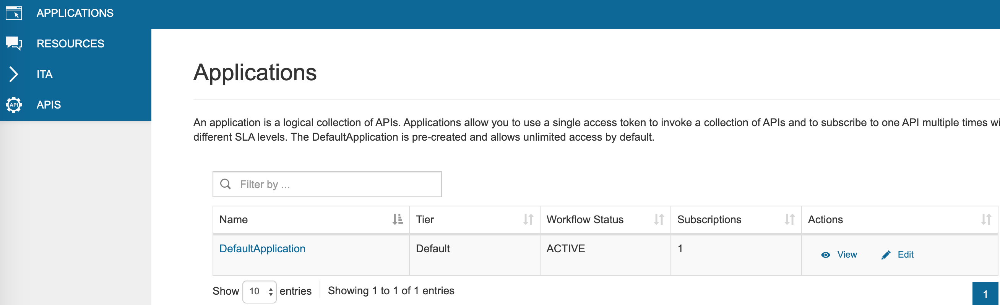
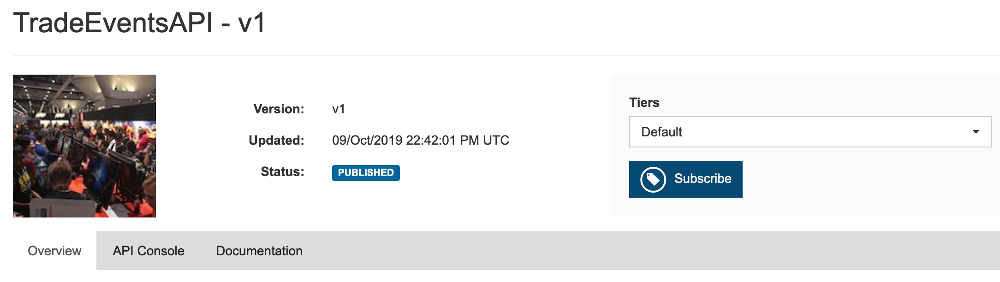
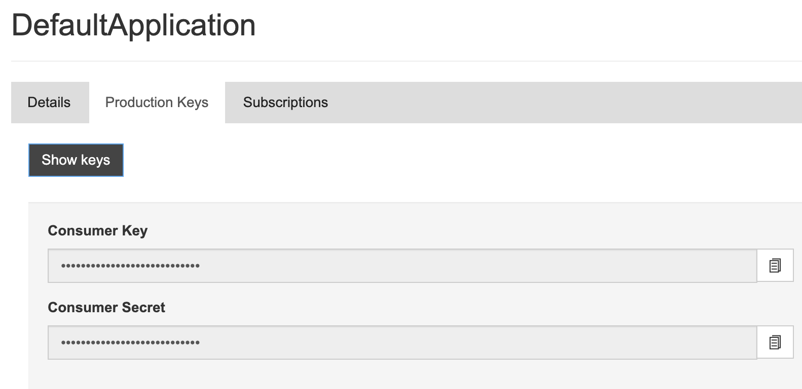
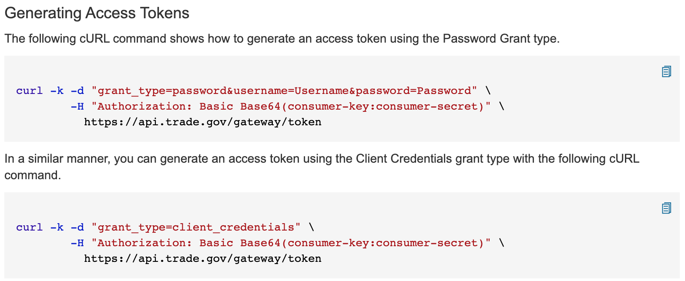
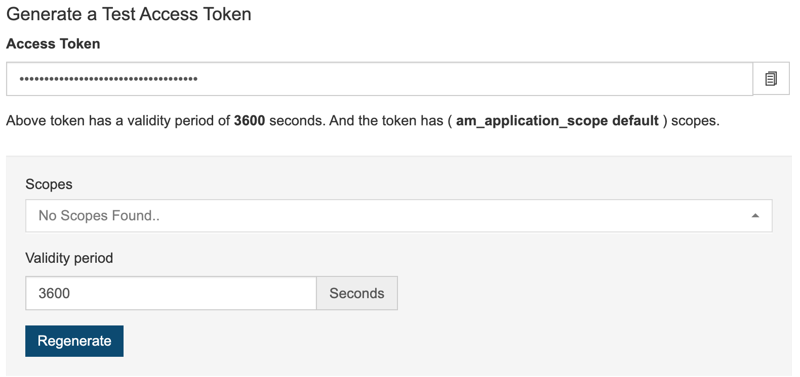
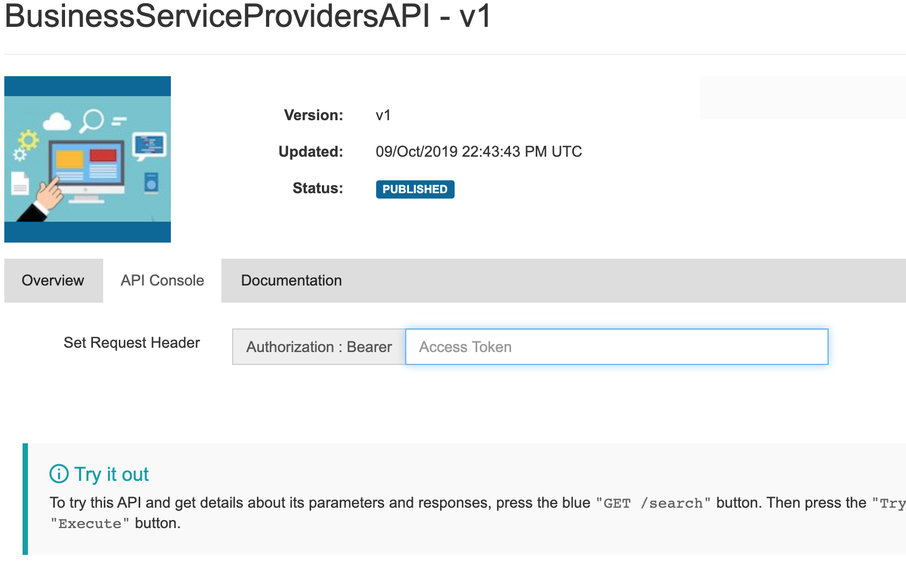
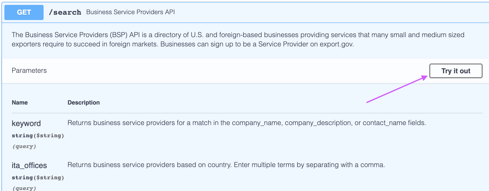
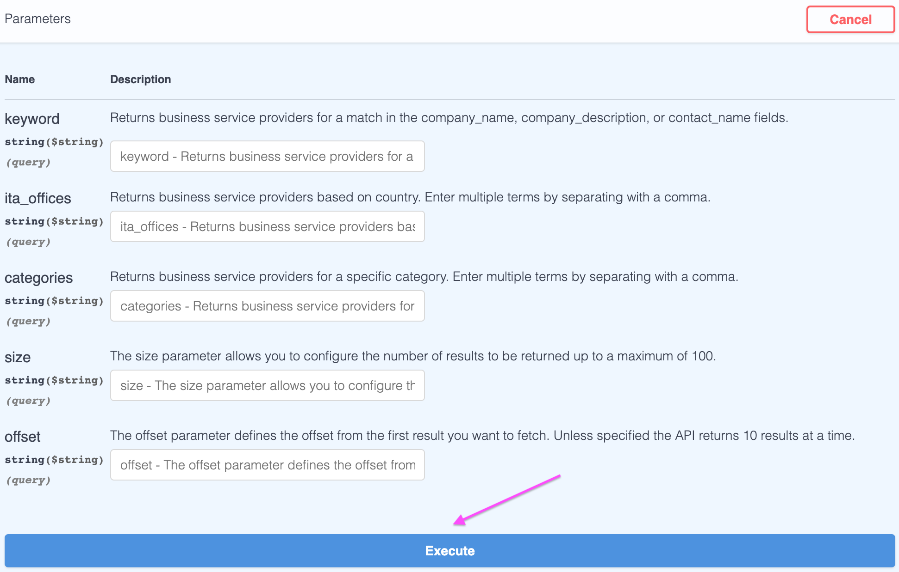
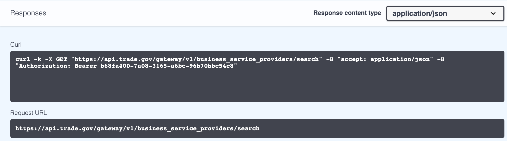

# Getting Started with the New API Store
* [Subscribing to an API](#subscribing-to-an-api)
* [Invoking an API](#invoking-an-api)
* [Frequently Asked Questions](#frequently-asked-questions)

## Subscribing to an API
1. Using the Login link at the top right corner, log in to the [API store](https://api.trade.gov/apps/store/apis/list). If you have not done this before, you will first need to create an account.
2. All our APIs are available. Click on an API to view its details.
3. The selected API’s information will be visible. As a subscribed user, you can now add ratings and provide comments to the API, which will be moderated.
4. An application is a logical collection of one or more APIs and is required when subscribing to an API. Select an application from the Applications drop-down list. You can use the default application or create a new one right from the drop-down list. You can view, create, rename, and delete applications from the “My Applications” tab.  

5. Select a service tier (currently we only have one tier) then click on the Subscribe button. If the subscription is successful, a message appears congratulating you on your successful subscription.  

## Invoking an API
The new APIs use Bearer Authentication, so your request must include this in the Authorization header `Authorization: Bearer <access_token>`.
1. You can get your Access Token using your Consumer Key and Consumer Secret in your Application's Production Keys Tab: 

    

  * You can use one of the two supplied cURL commands in your terminal  
    

  * Or, you can click "Generate Keys" (or "Regenerate") in the "Generate a Test Access Token" section.  This token will be then be displayed in the API console tab for a particular API when you're signed in.  
    
  
  **Note that Access Tokens default to expire after 1 hour (3600 seconds).  This value can be adjusted to your needs, or, you can set the Validity Period to `-1` for indefinite validity.**

2. In the API Console Tab, confirm that your Access Token is present in the `Authorization : Bearer` field, and click the blue "GET" button.  In the drop down console that appears, click "Try it out".  Here, you can enter in various query parameters, and click the "Execute" button under the query parameters to execute the request. 
  
  
  

3. Notice also that the request URL is updated from what you might have been using previously.  A customized cURL command is also available here so you can try it in your terminal, and shows the specific command that was executed.  

## Frequently Asked Questions
### General Questions
* _Where can I find the documentation for each of the APIs?_
  * In the API Console tab, after clicking on the `GET /search` button, you will find information on the parameters and the model for responses for that API.  The Overview tab has a brief summary about the substance and source of the data. 

### API Keys
* _How can I obtain an access token for production and another one for prototype?_
  * Currently, only one access token - the most recently generated, non-expired access token - is valid per application.  And at this time, each username can generate one application.

* _What is the difference between API Key and Access Token? Which do I use and how?_
  * The new API store uses the Bearer authentication scheme (also called token authentication), so instead of API keys, you have a Consumer Key and Consumer Secret, which are used to generate an Access Token.  Your application will likely use the Access Token to fetch data from the API.  
  For more information about the Access Token, see the instructions for [Invoking an API](#invoking-an-api).

### Throttling
* _When setting up a new API key, I noticed it states that 100 requests are allowed per minute per access token. Is that all the information about throttling available?_ 
  * Yes.  If you have more specific questions, please email [DataServices@trade.gov](mailto:DataServices@trade.gov?subject=API%20Request%20Throttling%20Question)

* _I have seen the information about the throttling. Are there any other restrictions that I should be aware of?_
  * See the [Terms of Service](https://api.trade.gov/apps/store/ita/terms-of-service) for more information.

* _How can we get the ability to run more than 100 requests per minute and what would the prices be?_
  * We are looking into offering higher limits of throughput. We will send out an email with additional information once we have additional information.

### Consolidated Screening List (CSL)
* _With the new API store, is it possible to download the entire CSL list?_
  * While the full CSL is not downloadable from the API, you can download it from export.gov as either a [CSV](https://api.trade.gov/consolidated_screening_list/search.csv?api_key=OHZYuksFHSFao8jDXTkfiypO) or a [TSV](https://api.trade.gov/consolidated_screening_list/search.tsv?api_key=OHZYuksFHSFao8jDXTkfiypO) file.

* _Are we still able to download the CSV and TSV files for the Consolidated Screening List?_
  * Yes, see above.

* _I have an API Key for downloading the CSV file. Do I need to get a new API key to continue downloading the CSV file?_
  * An API key is no longer needed for downloading the CSV file: https://www.export.gov/article?id=Consolidated-Screening-List