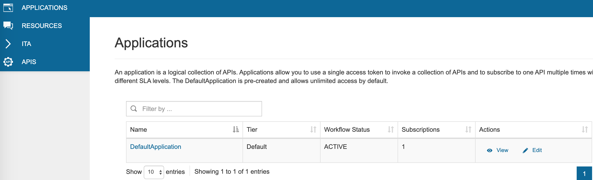
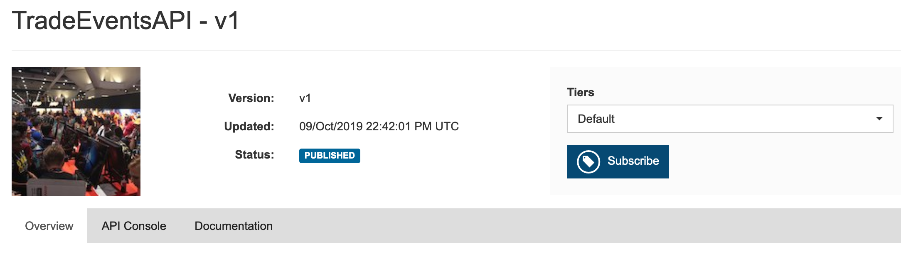
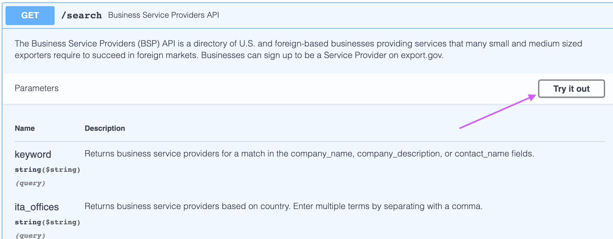
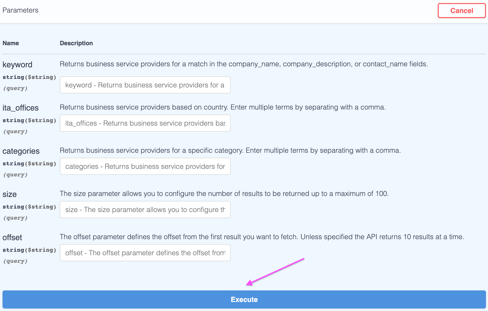

# Getting Started with the New API Store
* [Subscribing to an API](#subscribing-to-an-api)
* [Invoking an API](#invoking-an-api)
* [Frequently Asked Questions](https://internationaltradeadministration.github.io/DevPortalMessages/FAQs)

## Subscribing to an API

1. Sign In using the link at the top right corner of the [API store](https://api.trade.gov/apps/store/apis/list). If you have not done this before, you will first need to create an account.
2. Please go to the [Applications](https://api.trade.gov/apps/store/site/pages/applications.jag) page and generate an access token.
3. All our APIs are available. Please go to the [APIs](https://api.trade.gov/apps/store/apis/list) page and click on an API to view its details.
4. The selected API’s information will be visible.
5. Select a service tier (currently we only have one tier) then click on the Subscribe button. If the subscription is successful, a message appears congratulating you on your successful subscription.  

  An application is a logical collection of one or more APIs and is required when subscribing to an API. You can view and manage your subscriptions from the “Applications” page.  
  

## Invoking an API

The new APIs use Bearer Authentication, so your request must include this in the Authorization header `Authorization: Bearer <access_token>`.  
1. You can view or regenerate your Access Token in your Application's Access Token tab: 

    
  
  **If you regenerate the Access Token, the old Access Token expires. Only the most recent token is valid for each Application.**

2. Next, in the API Console Tab of an API to which you have subscribed, confirm that your Access Token is present in the `Authorization : Bearer` field, and click the blue "GET" button.  In the drop down console that appears, click "Try it out".  Here, you can enter in various query parameters, and click the "Execute" button under the query parameters to execute the request.  
  
  
  

3. Notice also that the request URL is updated from what you might have been using previously.  A customized cURL command is also available here so you can try it in your terminal, and shows the specific command that was executed.  

**For additional help with making HTTP requests using your access token, see [How to interact with the APIs using the new authentication type](https://internationaltradeadministration.github.io/DevPortalMessages/IntroToNewAuthType)**
