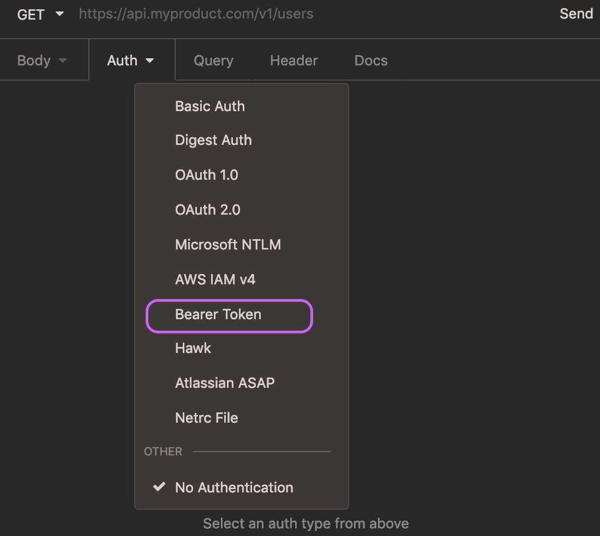
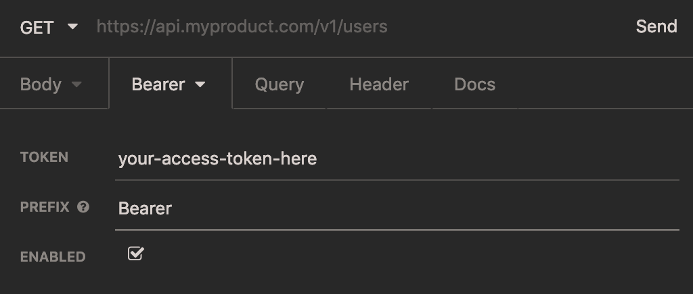
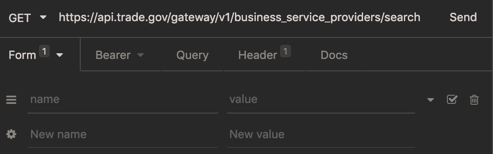
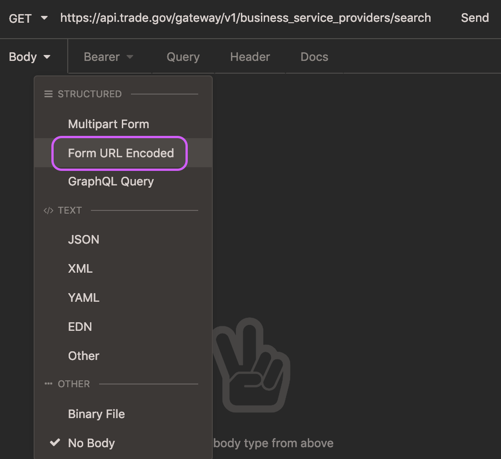
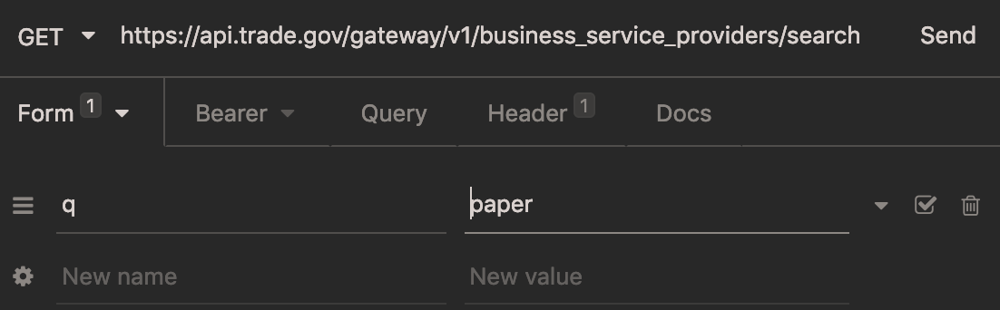
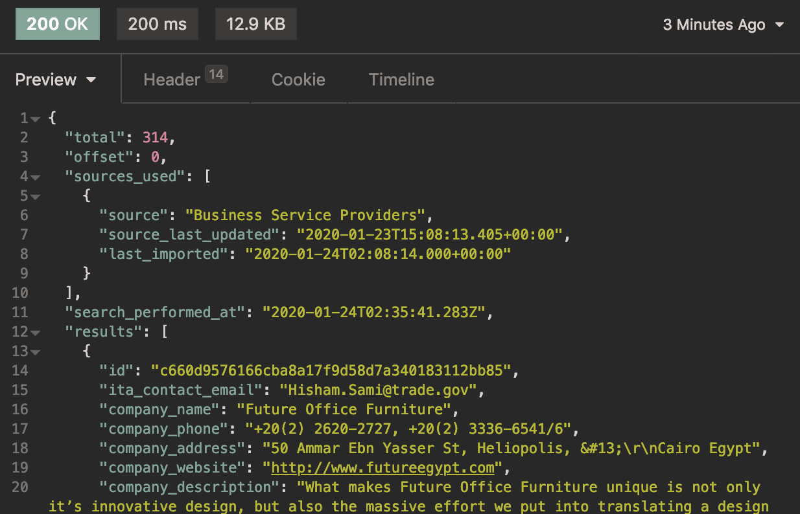
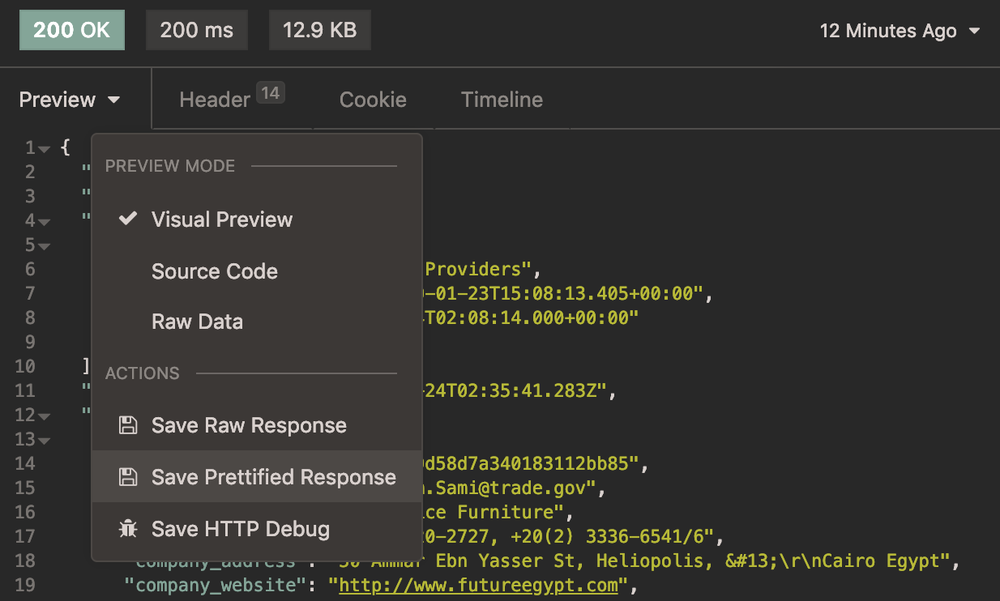

# How to interact with the APIs using the new authentication type
There are many ways to make HTTP requests.  Here are three to get you started.  
  * All of the tools and apps mentioned in this tutorial are open source and free to use for the purposes outlined here, however they are not specifically endorsed by the ITA or the U.S. Department of Commerce.  


1. **[Using a GUI](#using-a-gui-app)** (Graphical User Interface) like [Postman](https://www.getpostman.com/) or [Insomnia](https://insomnia.rest/), or a browser extension (like [Advanced REST Client](https://chrome.google.com/webstore/detail/advanced-rest-client/hgmloofddffdnphfgcellkdfbfbjeloo/related?hl=en-US) or similar).
2. **[In the API Console](#using-the-api-console)**; a convenient way to browse the data right from your web browser in the API Store
3. **[In your code base](#in-your-code-base)** for an application you're developing, likely using [`fetch()`](https://developer.mozilla.org/en-US/docs/Web/API/Fetch_API/Using_Fetch) or [`axios`](https://github.com/axios/axios) in JavaScript.


## Using a GUI app
If you're using Insomnia, start by creating a new `GET` request (click the plus icon, or use keyboard command+N or control+N on Windows/Linux).  In the "Auth" dropdown menu, select "Bearer Token".


Type in your access token in the "TOKEN" field, and type the word "Bearer" in the "PREFIX" field.


In the text field next to the word "GET", where there is currently placehold text of an API, enter in the production URL you'd like to work with, followed by `/search`.  These are found on the Overview tab of each API.  For example, for Business Service Providers, it's `https://api.trade.gov/gateway/v1/business_service_providers/search`.


Next, select the "Body" tab.  From the dropdown menu, select "Form URL Encoded".


The name of this tab will change autmatically to "Form".  In the new text fields that appear, enter in the parameter name and value.  You can enter in additional parameters by clicking on "New Name" or "New Value", or delete by clicking the trash icon.  


Last, click "Send". Your HTTP GET request, with headers, is on it's way.  The response will appear in the pane on the right.  


The green rectangle that reads "200 OK" indicates that your request returned with a status of 200, which means it was successful.  Note that a successful response might still yield no results; it means that the search worked, but the parameters returned no items. 
If the response is "401", it indicates a problem with the authentication.  It's possible that the access token has expired or that your application's access token has not yet subscribed to this API.
For more information about HTTP status codes, check out the MDN documentation: https://developer.mozilla.org/en-US/docs/Web/HTTP/Status

You can change the format of the previewed data, or download the JSON response using the "Preview" dropdown menu:  



## Using the API console

The `API Console` tab for each API in the store provides a form for users to construct queries and observe the return values.  From here, you can also download the responses for your entered query using the "Download" button in the "Response body" window.
More detailed instructions for navigating the API Console are available starting in step 2 of the [Invoking an API](https://internationaltradeadministration.github.io/DevPortalMessages/GettingStarted_NewAPIStore#invoking-an-api) section of the Getting Started Guide 

The API Console also generates a `curl` command and request URL.  _Optionally,_ the `curl` command can be used in the command line in your computer's terminal to accomplish the same thing as the GUI method described previously.  For more information about using `curl`, check out its documentation: https://curl.haxx.se/


## In your code base

There are many different ways to make HTTP requests, but in JavaScript, [`fetch()`](https://developer.mozilla.org/en-US/docs/Web/API/Fetch_API/Using_Fetch) is a commonly used method.

A request with a search query may look like this:
```js
fetch('https://api.trade.gov/gateway/v1/consolidated_screening_list/search?q=Michael', {
  headers: { 'Authorization': 'Bearer ' + yourAccessTokenHere }
})
  .then(response => response.json())
  // etc ...
```
You can construct the url in your usual way to include whatever search parameters are coming from your frontend form.
The `headers` object is included in a similar way if you're using axios.
If you're making your HTTP requests using XHR, then you'll want to include a line like this:
```js
req.setRequestHeader("Authorization", "Bearer " + yourAccessTokenHere);
```
between the `req.open()` and `req.send()` lines.